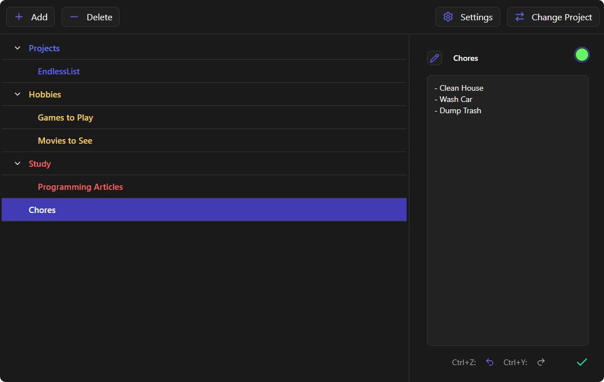

# EndlessList

EndlessList is a lightweight hierarchical list management application designed to help you organize your projects, tasks, and others types of information. It allows you to create deeply nested lists, keep track of detailed descriptions, and manage your data in a single place.

## Contributing

We welcome contributions by anyone. If you would like to help improve Endless List, whether by fixing bugs, adding new features, or improving documentation, feel free to fork the repository, make your changes, and submit a pull request. Your support and ideas are highly appreciated.

## License

This project is licensed under the MIT License - see the [LICENSE.md](LICENSE.md) file for details.
